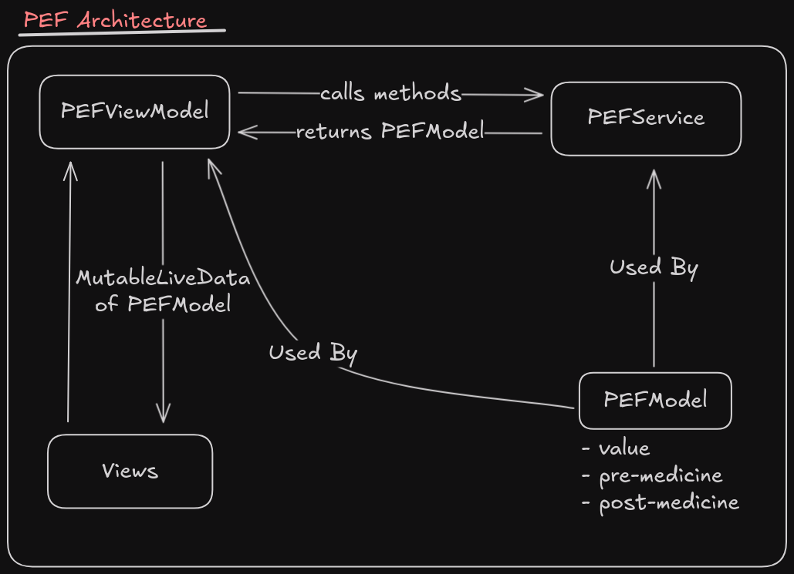
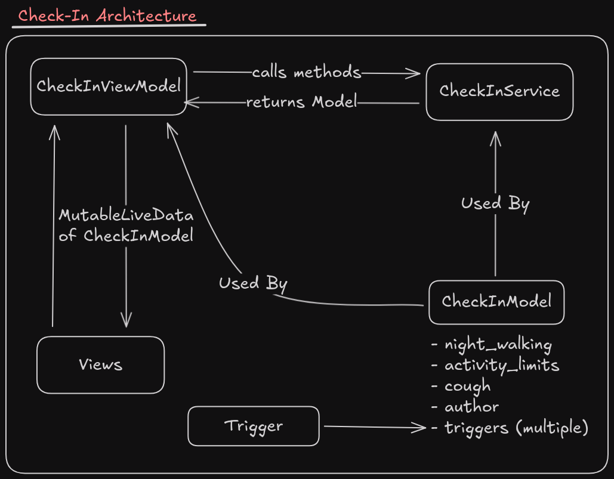
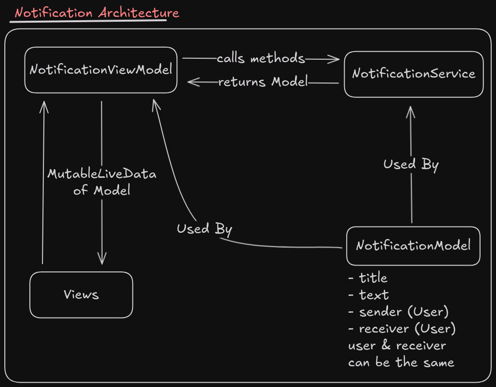
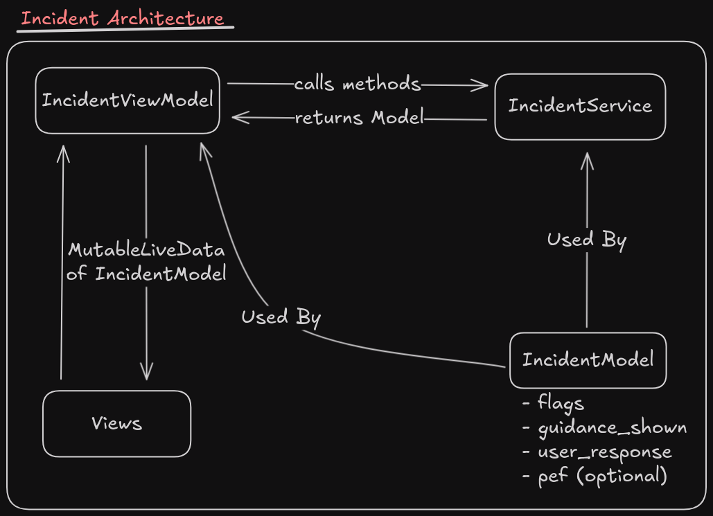

# B07 Project

## MVVM-Service Architecture


## Architectures
### Auth


### Medicine


### PEF


### Check-In


### Notification


### Incident


## Backend Schema
The following is the schema generated by running the `TestAPIActivity.java`
Note that for all dates, it should be in the format of `YYYY-MM-DD`.
```json
{
  "motivation": {
    "test-child-4bd00357-e207-47a0-9805-538bd247b147": {
      "streaks": {
        "medicineLog": {
          "best": 1,
          "current": 1,
          "updatedAt": 20423
        }
      }
    }
  },
  "reports": {
    "-OfQdw9ssV_WoSlebBVp": {
      "checkIns": [
        {
          "authorId": "test-parent-ce645fd1-96fd-4d2f-8167-c433a4b05ff7",
          "enteredByParent": true,
          "night_walking": {
            "entry_by_parent": false,
            "note": "nothing",
            "triggers": {
              "cold_air": true,
              "dust": false,
              "exercise": true,
              "illness": false,
              "perfume_odors": false,
              "pets": true,
              "smoke": false
            }
          },
          "time": 1764621795981,
          "uid": "test-child-4bd00357-e207-47a0-9805-538bd247b147"
        }
      ],
      "childId": "test-child-4bd00357-e207-47a0-9805-538bd247b147",
      "childName": "Test Child",
      "createdAt": 1764621796024,
      "endDate": 1764621795981,
      "incidents": [
        {
          "flags": {
            "blueLips": false,
            "cantSpeakFullSentences": true,
            "chestPulling": false,
            "severeWheeze": true,
            "unableToLieFlat": false
          },
          "guidance": "guidance text",
          "parentAlertSent": false,
          "pefNumber": 3,
          "rescueAttempts": 0,
          "time": 1764621895981,
          "uid": "test-child-4bd00357-e207-47a0-9805-538bd247b147"
        }
      ],
      "medicineLogs": [
        {
          "after": "better",
          "before": "worse",
          "controllerPlanId": "-OfQdw9TcBx6tQ4osV5s",
          "dose": 2,
          "medicineId": "-OfQdw9RwD5D9n86gPj7",
          "medicineType": "controller",
          "time": 1764621795981,
          "uid": "test-child-4bd00357-e207-47a0-9805-538bd247b147"
        }
      ],
      "medicines": [
        {
          "canister_puffs": 200,
          "expiry_date": "2026-01-26",
          "initialCanisterPuffs": 200,
          "inventoryId": "-OfQdw9RwD5D9n86gPj7",
          "lastUpdated": 1764621795996,
          "name": "Penicillin",
          "purchase_date": "2025-11-20",
          "replacement_reminder": "2026-01-26",
          "type": "controller",
          "uid": "test-parent-ce645fd1-96fd-4d2f-8167-c433a4b05ff7"
        }
      ],
      "parentId": "test-parent-ce645fd1-96fd-4d2f-8167-c433a4b05ff7",
      "parentName": "Test Parent",
      "pefLogs": [
        {
          "personalBestAtEntry": 350,
          "post_med": 300,
          "pre_med": 250,
          "time": 1764621795981,
          "uid": "test-child-4bd00357-e207-47a0-9805-538bd247b147",
          "zone": "Green"
        }
      ],
      "providerId": "test-provider-2636177f-916a-4a0d-8289-b322ed9252ef",
      "providerName": "Test Provider",
      "shareSettings": {
        "childId": "test-child-4bd00357-e207-47a0-9805-538bd247b147",
        "includeCheckIns": true,
        "includeControllerSummary": true,
        "includeIncidents": true,
        "includeMedicineLogs": true,
        "includeMedicines": true,
        "includePefLogs": true,
        "includeRescueLogs": true,
        "includeSummaryCharts": true,
        "includeSymptoms": true,
        "includeTriggers": true,
        "parentId": "test-parent-ce645fd1-96fd-4d2f-8167-c433a4b05ff7",
        "providerId": "test-provider-2636177f-916a-4a0d-8289-b322ed9252ef"
      },
      "startDate": 1764016995981,
      "summary": {
        "categorical": [
          {
            "label": "pets",
            "value": 1
          },
          {
            "label": "exercise",
            "value": 1
          },
          {
            "label": "cold_air",
            "value": 1
          }
        ],
        "controllerAdherencePercent": 0,
        "controllerScheduledDoses": 0,
        "controllerTakenDoses": 2,
        "lastRescueTime": 0,
        "rescueCount": 0,
        "symptomBurden": {
          "night_walking": 1
        },
        "zoneDistribution": {
          "Green": 1
        }
      },
      "uid": "-OfQdw9ssV_WoSlebBVp"
    }
  },
  "users": {
    "children": {
      "test-child-4bd00357-e207-47a0-9805-538bd247b147": {
        "checkIn": {
          "-OfQdw9lGNhE2EyNTAeA": {
            "authorId": "test-parent-ce645fd1-96fd-4d2f-8167-c433a4b05ff7",
            "enteredByParent": true,
            "night_walking": {
              "entry_by_parent": false,
              "note": "nothing",
              "triggers": {
                "cold_air": true,
                "dust": false,
                "exercise": true,
                "illness": false,
                "perfume_odors": false,
                "pets": true,
                "smoke": false
              }
            },
            "time": 1764621795981,
            "uid": "test-child-4bd00357-e207-47a0-9805-538bd247b147"
          }
        },
        "controllerPlans": {
          "-OfQdw9TcBx6tQ4osV5s": {
            "active": true,
            "childId": "test-child-4bd00357-e207-47a0-9805-538bd247b147",
            "createdAt": 1764621795981,
            "dosesPerDay": 2,
            "medicineId": "-OfQdw9RwD5D9n86gPj7",
            "notes": "Sample plan",
            "planId": "-OfQdw9TcBx6tQ4osV5s",
            "planName": "Controller plan",
            "startDate": "2025-11-01",
            "timesOfDay": [
              "08:00",
              "20:00"
            ],
            "updatedAt": 1764621795998
          }
        },
        "currentZone": "Green",
        "dateOfBirth": "2016-01-01",
        "email": "child+test-child-4bd00357-e207-47a0-9805-538bd247b147@example.com",
        "incidentLog": {
          "-OfQdw9pj3T078ijVDvF": {
            "flags": {
              "blueLips": false,
              "cantSpeakFullSentences": true,
              "chestPulling": false,
              "severeWheeze": true,
              "unableToLieFlat": false
            },
            "guidance": "guidance text",
            "parentAlertSent": false,
            "pefNumber": 3,
            "rescueAttempts": 0,
            "time": 1764621895981,
            "uid": "test-child-4bd00357-e207-47a0-9805-538bd247b147"
          }
        },
        "isAgeBelow9": true,
        "medicineLog": {
          "-OfQdw9nDv162xXjTMEr": {
            "after": "better",
            "before": "worse",
            "controllerPlanId": "-OfQdw9TcBx6tQ4osV5s",
            "dose": 2,
            "medicineId": "-OfQdw9RwD5D9n86gPj7",
            "medicineType": "controller",
            "time": 1764621795981,
            "uid": "test-child-4bd00357-e207-47a0-9805-538bd247b147"
          }
        },
        "name": "Test Child",
        "notification": {
          "-OfQdw9qghcqi9TnLCeq": {
            "childId": "test-child-4bd00357-e207-47a0-9805-538bd247b147",
            "createdAt": 1764621796017,
            "notificationId": "-OfQdw9qghcqi9TnLCeq",
            "status": "pending",
            "text": "Generated at Mon Dec 01 15:43:15 EST 2025",
            "title": "Firebase smoke test",
            "type": "triage_escalation"
          }
        },
        "parentId": "test-parent-ce645fd1-96fd-4d2f-8167-c433a4b05ff7",
        "parentNotes": "Sample note",
        "pefLog": {
          "-OfQdw9o8cVln2_znvLU": {
            "personalBestAtEntry": 350,
            "post_med": 300,
            "pre_med": 250,
            "time": 1764621795981,
            "uid": "test-child-4bd00357-e207-47a0-9805-538bd247b147",
            "zone": "Green"
          }
        },
        "personalBest": 350,
        "reports": {
          "-OfQdw9ssV_WoSlebBVp": true
        },
        "roles": {
          "child": true
        },
        "triageSessions": {
          "-OfQdw9rrRd0ILDAZoqM": {
            "childId": "test-child-4bd00357-e207-47a0-9805-538bd247b147",
            "decision": "HOME_STEPS",
            "flags": {
              "blueLips": false,
              "cantSpeakFullSentences": true,
              "chestPulling": true,
              "severeWheeze": false,
              "unableToLieFlat": false
            },
            "guidanceShown": "Use rescue inhaler and start home steps.",
            "parentAlertSent": true,
            "parentAlertSentAt": 1764621795981,
            "pefNumber": 260,
            "rescueAttempts": 1,
            "sessionId": "-OfQdw9rrRd0ILDAZoqM",
            "startedAt": 1764621795981,
            "status": "RESOLVED",
            "userResponse": "Following guidance"
          }
        },
        "uid": "test-child-4bd00357-e207-47a0-9805-538bd247b147"
      }
    },
    "parents": {
      "test-parent-ce645fd1-96fd-4d2f-8167-c433a4b05ff7": {
        "email": "parent+test-parent-ce645fd1-96fd-4d2f-8167-c433a4b05ff7@example.com",
        "inventory": {
          "-OfQdw9RwD5D9n86gPj7": {
            "canister_puffs": 200,
            "expiry_date": "2026-01-26",
            "initialCanisterPuffs": 200,
            "inventoryId": "-OfQdw9RwD5D9n86gPj7",
            "lastUpdated": 1764621795996,
            "name": "Penicillin",
            "purchase_date": "2025-11-20",
            "replacement_reminder": "2026-01-26",
            "type": "controller",
            "uid": "test-parent-ce645fd1-96fd-4d2f-8167-c433a4b05ff7"
          }
        },
        "name": "Test Parent",
        "reports": {
          "-OfQdw9ssV_WoSlebBVp": true
        },
        "roles": {
          "parent": true
        },
        "uid": "test-parent-ce645fd1-96fd-4d2f-8167-c433a4b05ff7"
      }
    },
    "profiles": {
      "test-child-4bd00357-e207-47a0-9805-538bd247b147": {
        "email": "child+test-child-4bd00357-e207-47a0-9805-538bd247b147@example.com",
        "name": "Test Child",
        "roles": {
          "child": true
        },
        "uid": "test-child-4bd00357-e207-47a0-9805-538bd247b147"
      },
      "test-parent-ce645fd1-96fd-4d2f-8167-c433a4b05ff7": {
        "email": "parent+test-parent-ce645fd1-96fd-4d2f-8167-c433a4b05ff7@example.com",
        "name": "Test Parent",
        "roles": {
          "parent": true
        },
        "uid": "test-parent-ce645fd1-96fd-4d2f-8167-c433a4b05ff7"
      },
      "test-provider-2636177f-916a-4a0d-8289-b322ed9252ef": {
        "email": "provider+test-provider-2636177f-916a-4a0d-8289-b322ed9252ef@example.com",
        "name": "Test Provider",
        "roles": {
          "provider": true
        },
        "uid": "test-provider-2636177f-916a-4a0d-8289-b322ed9252ef"
      }
    },
    "providers": {
      "test-provider-2636177f-916a-4a0d-8289-b322ed9252ef": {
        "email": "provider+test-provider-2636177f-916a-4a0d-8289-b322ed9252ef@example.com",
        "name": "Test Provider",
        "reports": {
          "-OfQdw9ssV_WoSlebBVp": true
        },
        "roles": {
          "provider": true
        },
        "uid": "test-provider-2636177f-916a-4a0d-8289-b322ed9252ef"
      }
    }
  }
}
```
