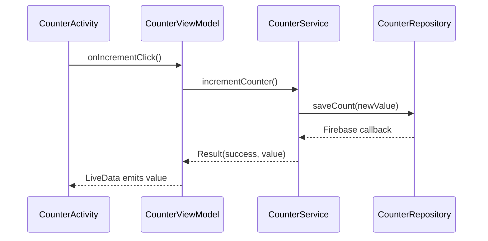

# B07 Project

## M-V-VM 
```
View (Activity/Fragment)
    ↓
ViewModel / Controller
    ↓
Repository (talks to Firebase)
    ↓
Model (plain data classes)
```

### Sample MVVM + Service Flow



#### Sample Code

```java
// CounterService.java
public interface CounterService {
    void increment(Callback<Integer> callback);
    interface Callback<T> {
        void onSuccess(T value);
        void onError(Throwable t);
    }
}
```

```java
// FirebaseCounterService.java
public class FirebaseCounterService implements CounterService {
    private final CounterRepository repository;

    public FirebaseCounterService(CounterRepository repository) {
        this.repository = repository;
    }

    @Override
    public void increment(Callback<Integer> callback) {
        repository.fetchCount()
                .addOnSuccessListener(count -> {
                    int updated = count + 1;
                    repository.saveCount(updated)
                            .addOnSuccessListener(v -> callback.onSuccess(updated))
                            .addOnFailureListener(callback::onError);
                })
                .addOnFailureListener(callback::onError);
    }
}
```

```java
// CounterViewModel.java
public class CounterViewModel extends ViewModel {
    private final MutableLiveData<Integer> counter = new MutableLiveData<>(0);
    private final CounterService service;

    public CounterViewModel(CounterService service) {
        this.service = service;
    }

    public LiveData<Integer> getCount() {
        return counter;
    }

    public void increment() {
        service.increment(new CounterService.Callback<Integer>() {
            @Override
            public void onSuccess(Integer value) {
                counter.postValue(value);
            }

            @Override
            public void onError(Throwable t) {
                // handle error (snackbar/log/etc)
            }
        });
    }
}
```

```java
// CounterActivity.java
public class CounterActivity extends AppCompatActivity {
    private CounterViewModel viewModel;

    @Override
    protected void onCreate(Bundle savedInstanceState) {
        super.onCreate(savedInstanceState);
        setContentView(R.layout.activity_counter);

        CounterRepository repo = new CounterRepository(FirebaseDatabase.getInstance());
        CounterService service = new FirebaseCounterService(repo);
        viewModel = new ViewModelProvider(this, new CounterVmFactory(service)).get(CounterViewModel.class);

        TextView counterText = findViewById(R.id.counter_text);
        Button incrementButton = findViewById(R.id.increment_button);

        viewModel.getCount().observe(this, value -> counterText.setText(String.valueOf(value)));
        incrementButton.setOnClickListener(v -> viewModel.increment());
    }
}
```

```java
// CounterVmFactory.java
public class CounterVmFactory implements ViewModelProvider.Factory {
    private final CounterService service;

    public CounterVmFactory(CounterService service) {
        this.service = service;
    }

    @NonNull
    @Override
    public <T extends ViewModel> T create(@NonNull Class<T> modelClass) {
        if (modelClass.isAssignableFrom(CounterViewModel.class)) {
            return (T) new CounterViewModel(service);
        }
        throw new IllegalArgumentException("Unknown ViewModel class");
    }
}
```

Each layer has a single responsibility:
- `View` only reacts to `LiveData` and forwards UI events.
- `ViewModel` requests work from the service and exposes state.
- `Service` coordinates async work (network/database) and hides Firebase specifics.
- `Repository` performs the actual Firebase read/write and returns tasks/promises.
